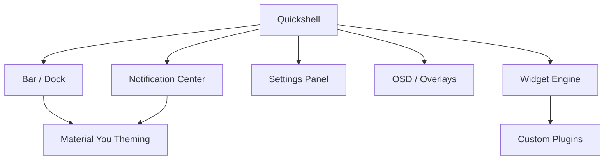

  

      

  <b>A complete desktop shell for the Niri compositor, built on Quickshell</b>

---

## 🐧 Overview

iNiR — a feature-rich desktop shell for the Niri Wayland compositor with Material You auto-theming, bar, dock, notifications, settings panel, OSD, and an extensive plugin/widget system.

---

## 🛠️ Features

- Material You dynamic color theming
- Modular widget/plugin system
- Notifications with history
- Settings GUI for shell preferences
- Nix flake for reproducible builds

---

## 🚀 Tech Stack

    

---

  

